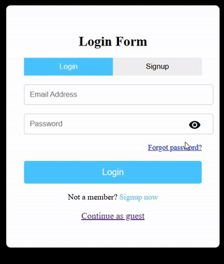

# EMU-webApp-expanded

## Introduction
The EMU-WebApp-expanded is a web-based linguistic database designed to support multi-tiered linguistic annotations and advanced querying of multimodal files. The system allows users to manage and annotate a variety of data types, including audio, video, image, and PDF documents. Built with an AngularJS and TypeScript frontend and a Node.js/Express backend with MongoDB, the application provides powerful tools for collaborative research, advanced search, and secure, role-based access.

## Quick Start
To use the application visit [emu-webapp-expanded](https://emu-webapp-frontend.netlify.app/#!/login)

## Features - User Guide
The users that want to use the application would have to sign up, login or use the 'continue as guest' option:

They can upload a variety of data types including audio (.wav), video (.mp4), pdf and images. For each data type they can add the following annotations.

🔷 For **audio** files: 
* phonetic and orthographic transcriptions where they can add levels, drag-n-choose a section of the waveform and add a label to it
* add metadata ·informations about the recording, the speakers, the recording conditions, etc. They can also download the metadata form in IMDI form

🔷 For **video** files:
* the same annotations as the wav files, with the addition of an annotation-table (that can be downloaded)
* add metadata 

🔷 For **pdf** files:
* navigate the pages and mark words in the pdf
* linguistic annotations where the user can choose to study a word or a phrase by it's part-of-speech, named-entity-recognition, sentiment-analysis and other comments
* annotation table that can be downloaded
* add metadata 

🔷 For **image** files, the application has been adapted to support the annotation of non-english languages and dialects:
* annotations like equivalent-from-english-alphabet, meaning-of-symbol, meaning-of-phrase, other comments
* annotation table that can be downloaded 
* add metadata 

🔷 General Features:
* clear button
* profile button

🔷 Save **_annot.json**:
* the user can save the annot.json file (a file that contains a selection of the annotations he added). This allows them to upload it in a later session along with their original file (e.g., WAV, image, video, or PDF) to resume annotating from where they left off and save their progress!

The simple users can't save to the database but they can view the files (and their annotations). The can also search through the database and download the results of their search.

🔷 Other **assigned users** (that can save to the database):
* **EY** -> can add files to the database, sign-up admins and appoint a file to them. 
* **Admin** -> can annotate and edit only their own files, and no other database files. They can also sign-up and choose researchers to help them with the annotation of their assigned files
* **Researcher** -> can annotate and edit only their own files

## Project Structure
The project is split into three diffeent repositories. 

🔷 [emu_thesis_locally](https://github.com/aristeap/emu_thesis_locally.git)
* is the original version that i built in my pc and was running with commands i run in the terminal. 
* it uses angularJs, typescript, javascript and for the database: mongodb, emuDB and technologies like gridFsBucket for the big data 

🔷 [emu-webapp-frontend](https://github.com/aristeap/emu-webapp-frontend.git)
* is the front-end repository

🔷 [emu-webapp-backend](https://github.com/aristeap/emu-webapp-backend.git)
* is the back-end repository

## Deployment & Live Demo
For the deployment to be possible:
* **code wise** : i adapted the [emu_thesis_locally](https://github.com/aristeap/emu_thesis_locally.git) by removing any references to local directories (emuDBrepo) and replaced them with references το the S3 AWS bucket. I also replaced all database references the url of the database i set up in Mongodb Atlas. Also i replaced all calls to the localhost
* **Backend Deployment** : The backend API and server are deployed on **Render**, a Platform as a Service (PaaS) provider. Render manages the server, allowing the backend to run continuously and handle all data processing, including secure communication with the MongoDB Atlas database and the S3-compatible object storage for files.
* **Frontend Deployment** : The client-side application is hosted on **Netlify**, a serverless platform that efficiently serves the static files (HTML, CSS, JavaScript) from a global Content Delivery Network (CDN). This ensures the application loads quickly for users worldwide.
* **Third-party wake-up service** : To make sure the application stays active, a free uptime monitoring service was set up to periodically send a request to the backend, preventing it from going to sleep (**Better Stack**) 

## Original EMU-webApp 
This application was created as my thesis project and it is based on the [EMU-webApp](https://github.com/IPS-LMU/EMU-webApp.git), the web-app of the EMU-sdms system. All credits to the original authors: 
main  authors: [Raphael Winkelmann](https://github.com/raphywink), [Georg Raess](https://github.com/georgraess), [Markus Jochim](https://github.com/MJochim), [Affiliations](https://www.en.phonetik.uni-muenchen.de/index.html)

🔷 This project significantly extends the base EMU-WebApp by adding several key features. The core enhancements include:
* **Standalone Operation**: The application now operates autonomously, eliminating the need for R code or an R environment. This provides a seamless startup experience and a more familiar, user-friendly interface.
* **Multimodal File Support**: The system has been expanded to support a wide range of file types beyond just audio, including video, PDF documents, and images. Users can now add annotations to each file type, making it a truly versatile tool.
* **Advanced Metadata Management**: A comprehensive system was implemented to support the creation, editing, and storage of rich metadata for every file. This allows for detailed organization and categorization of all content.
* **User Hierarchy and Access Control** : A role-based access model was introduced to manage user permissions. This defines which users can view, comment on, or manage the content and its metadata, ensuring secure and controlled collaboration.
* **Sophisticated Search Engine** : A powerful search engine was developed that combines both metadata and annotation filters. This flexible system allows users to extract, aggregate, and reproduce specific segments of audio, video, text, or images based on complex queries

## Missing Functionality and more to come...
* forgot-password-button
* settings button in profile 
* more choises for edit_profile
* a choise for 'continue without signing-in' (because the average user might be discouraged to use the app if he sees a sing-up page)  
* cleanup of the console-logs

## Contact
I would love to hear any feedback, ideas for additional functionality or any questions you might have 😊! Contact me anytime at : 
* [aristeapapaspyroy@gmail.com](mailto:aristeapapaspyroy@gmail.com)
* [Linkedin](https://www.linkedin.com/in/aristea-papaspyrou-8277a02a0/)

## Additional docs
URL to the full documentation of my thesis project [nemertes University of Patras](https://nemertes.library.upatras.gr/items/56d191eb-10c4-4883-b069-4e5bc023bec2)
